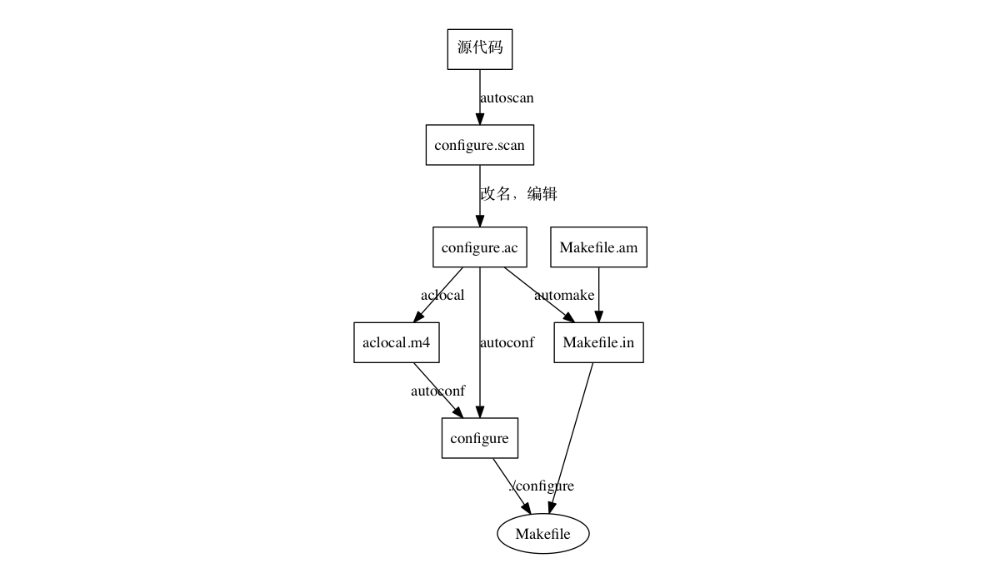
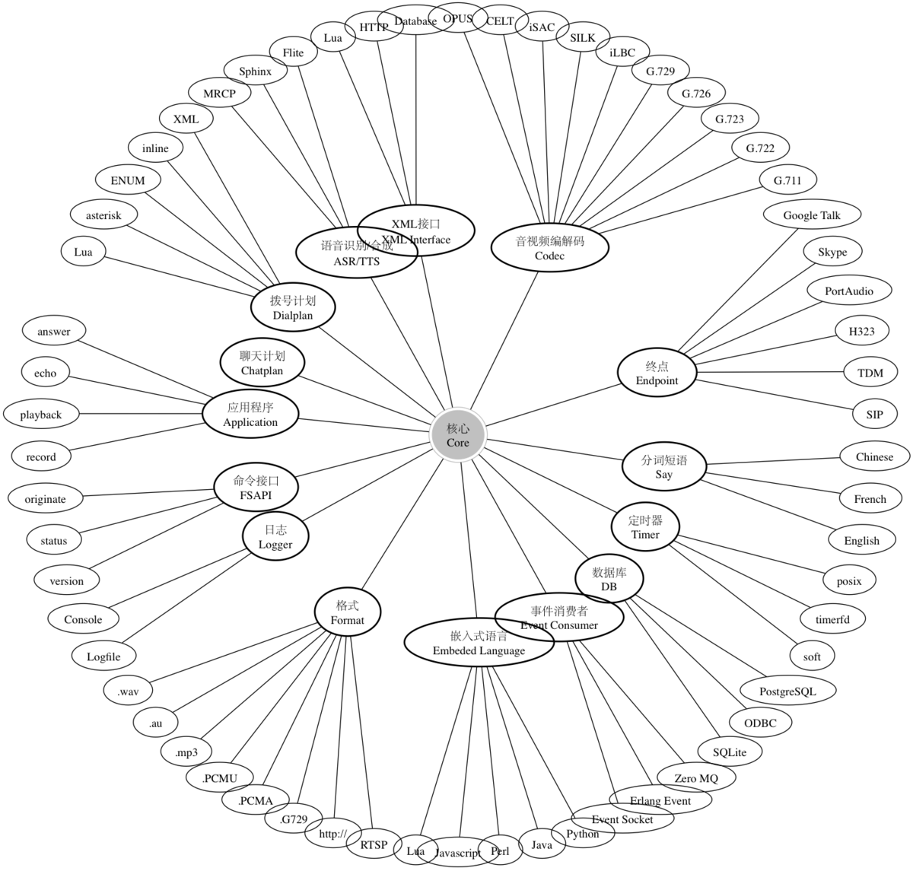
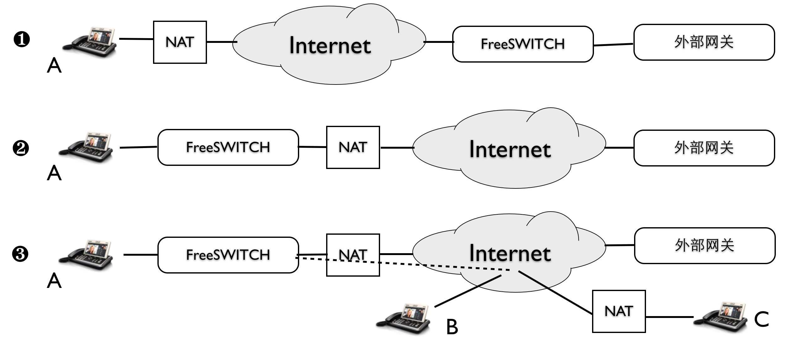
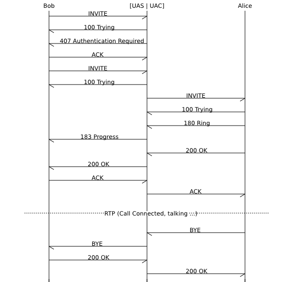

# 我在Mac上的写作工具链 {#writing-tools}

> 杜金房/2015.08.13/来自FreeSWITCH-CN公众号

有读者问我在写书时是如何画插图又如何生成PDF的，今天，就跟大家分享一下。

先讲个故事。

大约09年底10年初的时候，我就想写点关于FreeSWITCH的东西，也希望最后能汇集成书。因此，我从最开始就研究怎么排版。

最开始，是从第二章写起的。当时直接使用Textmate写，使用Latex语法，用PdfLatex转成PDF。事实证明，写的很痛苦。因为，跟那些写小说的人不同，我的书中有好多代码。大段的代码还好说，直接嵌入段落中的代码就比较麻烦，必须用一堆`$$`括起来，而且，如果代码中有`$`就得用`\$`转义。不幸的是，我最开始写的那一章中有很多的`$`。

后来，发现写书是很遥远的事，就开始把内容放到我的博客上。博客是自己建的，使用简单的Markdown格式。Markdown写起来很方便，而且兼容HTML，一切都好。

但我一直忘不了寻求如何生成PDF的方案。也尝试过RestructuredText等方案，但都不完美。

再后来，一个自称是Tim Yang的网友鼓励我把书印出来。排版的事就又提上了日程。由于我时间不多，一个老朋友答应帮忙。后来，还真让她整理出了一个Word版。但是，问题是Word版里有很多地方需要改，而修改Word版，不仅是很累的活，而且，无法同步回Markdown，并且我也不怎么喜欢（极其讨厌）Word。所以，我只好把那么精心打造的Word版给废了。再次寻找从Markdown生成PDF的方案。很幸运，我找到了Pandoc。

Pandoc是用Haskell编写的软件，能从各种文件格式中互转。比较典型的就是从Markdown转成PDF、HTML和Word。

当然，它还是先将Markdown转成Latex，再从Latex转成PDF。通过精心调校以及一些Shell脚本的帮助（用于调整Latex），终于能生成比较美观的PDF了。书也印了出来，名为《FreeSWITCH：VoIP实战》。在第一届FreeSWITCH沙龙上卖出去几本，后来又间或有人来买，书也一直在更新。

但，PDF比较美观，跟完美还差一个数量级。所以，我也一直在改进。当然，在过去的几年里，Pandoc也一直在升级。

后来，我从PdfLatex转成了XeLatex，效果要好很多（具体差别细节不记得了）。我的书中有很多脚注，写起来非常方便。而且，在使用中，我也慢慢学会了如何通过在Markdown中适当地嵌入一些Latex标记来做交叉链接。现在，除了还有下列两个问题外，已经几近完美了。

1）我还没有搞定字体（我希望某些引用使用楷体，不知道为什么使用楷体后有些副作用），好在我可以通过改变字号变相的区别。

2）图文混排控制力较弱。如果不在Markdown中增加Latex标记（我不想增加），就只能实现简单的图文混排，即图片永远占一行，而无法使用文字环绕。这种情况的一个最大问题就是一个竖版的图片，往往会占一整页。如果不想让它占一整页，只好修改图片，用白色或无色背景加宽。好在我会点PS。

同样的Markdown也可以生成ePub格式，从ePub可以继续生成Kindle格式。这两种格式与PDF格式比起来，还不是很完美（因为PDF有Latex帮助，而ePub版不能利用Latex标签，如果需要更好的ePub，需要一些相关的插件才行），但是，一般来说也够用了，在移动设备上有比较好的阅读体验。

不过，即使你的Latex和PDF再精美，出版社也不会用的。后来，出书的时机成熟后我发现，我的出版社只接受Word格式的稿子。他们说中国的环境不足以养一个会Latex的编辑。另外，Word的修改和批注功能确实没有什么很好的替代品。我虽然跟他们说『我们可以使用Git啊』，但他们只是笑笑。其实我自己也知道，Git是基于行的，不适合diff大段的文本（更别提中文单词和标点之间没有空格了）。

所以，我只好将我的Markdown通过Pandoc转成Word格式。再跟编辑们一遍遍地校对和修改。当然，这些修改就只存在于Word版了。除非手工同步修改Markdown，不可能再从Word版转回原来的Markdown。好在，书出版以后，我不需要再继续打印了。因此，也没有必要再保持Markdown跟最终的版本同步。而且，出版社给出了一个Word模版，通过使用一些快捷键，可以很方便地格式化一级标题二级标题以及代码块等，手工按这些快捷键处理一章也基本上就是几分钟的事（Pandoc似乎也支持模板，但我没有试过，因为反正在编辑的时候还是要再次阅读和修改的）。

书于去年6月出版，出版时的名字叫《FreeSWITCH权威指南》。

后来，在读了《Producter》一书（电子书）后，我也深受启发，在SelfStore上发了几本我的电子书《FreeSWITCH互联互通》、《FreeSWITCH实例解析》等。

当然，如果我今天只讲故事，没有干货的话，你可能觉得我是在做广告了。所以，接下来干货。

在写书时，要有很多的插图。据说Mac上最好的画图工具是OmniGraffle，然而，我始终没有冲动试用它。而是尝试了很多不同的软件：Skitch、Dia、yEd、XMind、Keynote等。这些软件的问题是画得不好看，而且风格不统一。所以，最后，我又回到了程序员神器——Graphviz。

通过Graphviz，可以使用很简单的dot语言画出很复杂的图，比如今天的题图，对应的dot源文件如下（虽然长，但很直观）：

```c
graph G {
	ranksep = 3;
	ratio = auto;

	A [label = ""];
	B [label = ""];
	C [label = ""];
	D [label = ""];
	E [label = ""];
	F [label = ""];
	G [label = ""];
	H [label = ""];
	I [label = ""];
	J [label = ""];

	A -- B;
	A -- C;
	A -- D;
	A -- E;
	A -- F;
	A -- G;
	A -- H;
	A -- I;
	A -- J;
	B -- C;
	B -- D;
	B -- E;
	B -- F;
	B -- G;
	B -- H;
	B -- I;
	B -- J;
	C -- D;
	C -- E;
	C -- F;
	C -- G;
	C -- H;
	C -- I;
	C -- J;
	D -- E;
	D -- F;
	D -- G;
	D -- H;
	D -- I;
	D -- J;
	E -- F;
	E -- G;
	E -- H;
	E -- I;
	E -- J;
	F -- G;
	F -- H;
	F -- I;
	F -- J;
	G -- H;
	G -- I;
	G -- J;
	H -- I;
	H -- J;
	I -- J;
}
```

又比如下图：



源文件加上空行也只有22行（为了在手机上减少换行，取消了缩进）：

```c
digraph G {
splines = false;

S [label="源代码" shape = "box"];
SCAN [label = "configure.scan" shape = "box"];
IN [label = "configure.ac" shape = "box"];
ACLOCAL [label = "aclocal.m4" shape = "box"];
configure [shape = "box"];
MakefileAm [label = "Makefile.am" shape = "box"];
MakefileIn [label = "Makefile.in" shape = "box"];

S->SCAN [label = "autoscan"];
SCAN -> IN [label = "改名，编辑"];
IN -> ACLOCAL [ label = "aclocal"];
ACLOCAL -> configure [ label = "autoconf"];
IN -> configure [ label = "autoconf"];
MakefileAm -> MakefileIn;
IN -> MakefileIn [ label = "automake"];

MakefileIn -> Makefile;
configure -> Makefile [label = "./configure"];
}
```

而所有的dot文件，只是靠一个简单的Makefile和一个`make`命令就会部都转成PNG图片了。同时，dot文件还可以存在Git仓库里。

谁能告诉我，像下面这样的图（如图\ref{fig:fs-structure}）用OmniGraffle或Windows上的Visio画累不累呢？



当然，并不是所有插图都适合用Graphviz。所以，除此之外，我还使用Keynote。Keynote比较适合画这样的图（是的，Internet也是我用弧线画出来的，如图\ref{fig:keynote-nat}）：



还有一个问题。那就是，以上工具都不适合画时序图。因此，我不得不又搜遍互联网，找到一个类似Graphviz的工具——mscgen。是的，跟我期望的一样，它可以使用类似dot的语法画时序图，大概就是下面这个样子，如图\ref{fig:sip-mscgen}：



搞过通信的人应该对上面那种图都非常熟悉。当然mscgen在Mac上生成图时对中文的处理有点问题。我只好首先用mscgen生成svg，然后又用Inksape将svg转换成PNG。

你还在用Word写API文档和产品说明文档吗？反正我们已经全部是Markdown了。虽然Word也可以进行『文件比较』，但怎么也不如`git diff`来得顺手吧？

好了。这基本上就是全部的秘密了。如果大家感兴趣，我以后也可以跟大家分享一些相关的脚本和源文件。程序员万岁。
