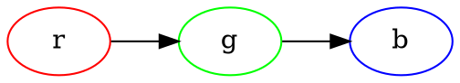
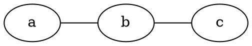
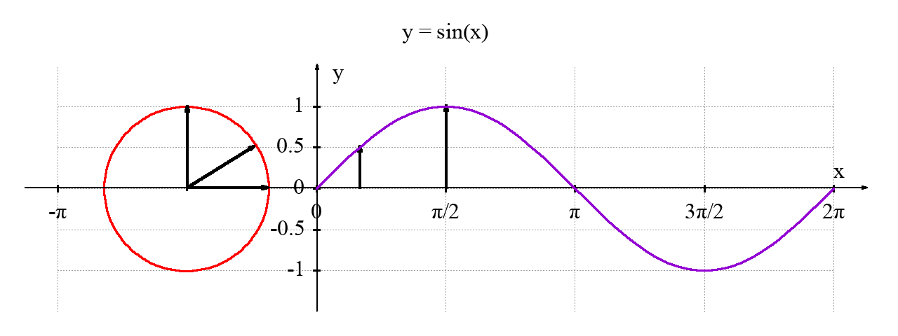
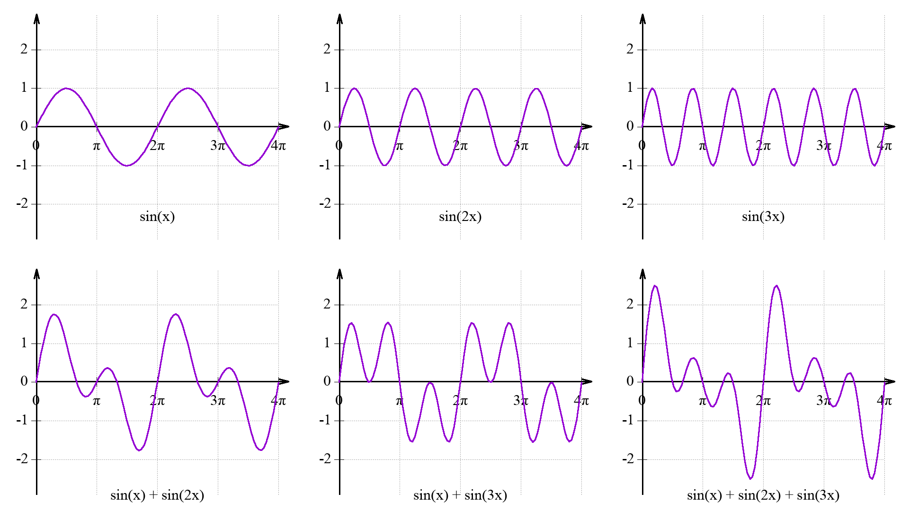

# 插图和公式 {#figures-and-equations}

Markdown 支持原生的插图和公式。也可以针对不同的输出格式，使用不同的插图和公式语法。

## 插图 {#figures}

在 Markdown 中，插入一张图片很简单，语法如下：

```

```


图片默认会以页面大小 100%宽度显示，可以使用如下方法调整图片的宽度（这在长图片排版时非常有用，可以防止图片显示过大）：

```
{ width=50% }
```

{ width=50% }

也可以插入带标题（caption）的图片，图片将会自动生成编号：

```
{ width=50% }
```

{ width=50% }

可以在正文中引用图片，如图\ref{fig:typesetting}所示（注意，该方法在 docx 格式中不好用）。

```
{ width=50% }
```

{ width=50% }

通过`diagram-generator.lua`，可以直接在 Markdown 中内嵌流程图。如下面的代码可以生成一个有向图：

````

````


也可以使用 Mscgen 画图，代码和图如下：

````
```msc
msc {
    alice, bob;

    alice -> bob[label="Hello World!"];
    bob -> alice[label="你好，世界！"];
}
```
````

```msc
msc {
    alice, bob;

    alice -> bob[label="Hello World!"];
    bob -> alice[label="你好，世界！"];
}
```

可以给图片源加标题，如：

````
```{.graphviz caption="这是一张有标题的图片"}
digraph G {
    rankdir=LR
    a -> b -> c
}
```
````

```{.graphviz caption="这是一张有标题的图片"}
digraph G {
    rankdir=LR
    a -> b -> c
}
```

**注意**：只有具有标题的图片才会自动生成图片编号。

也可以这样引用图片，如图\ref{fig:example-1}所示。

````
```{.graphviz caption="\label{fig:example-1}这是另一张有标题的图片"}
graph G {
    rankdir=LR
    a -- b -- c
}
```
````

```{.graphviz caption="\label{fig:example-1}这是另一张有标题的图片"}
graph G {
    rankdir=LR
    a -- b -- c
}
```

自 Pandoc 3.0 版（2023 年初发布）起，支持如下格式的语法（这样看起来更一致，可以与上面的写法对比其异同）：

````

````

我们使用自己搭的 Gitea[^gitea]服务器管理我们的 Markdown。为了能直接在 Web 界面上显示上述图片，我们写了一个浏览器插件：<https://git.xswitch.cn/xswitch/giteaBar> ，供大家参考。当然，团队中每个人都装插件比较麻烦，因此，我们弃用了上述插件，并[自己定制了一版](https://docs.gitea.io/en-us/customizing-gitea/)。

[^gitea]: 参见 <https://gitea.io/> 。

Github 已经支持使用 Mermaid[^mermaid]画图。直接使用如下语法即可。

[^mermaid]: 参见 <https://mermaid-js.github.io/mermaid/#/> 。

````

````

但我们的 PDF 中暂时还不支持这个语法，主要是 Docker 镜像已经很大了，如果再加上 Mermaid，就会更大，而且，比起来，Mermaid 来的图并不怎么好看。

后来，我还学会了使用 Gnuplot[^gnuplot]画图。下面的图是我画的圆与正弦波的图。以后有了时间，我也会讲讲我是怎么画的。

[^gnuplot]: <http://www.gnuplot.info/> 。





## 公式 {#equations}

Markdown 支持行内公式，简单的公式可以使用原生的上下标格式写。上标写为`x^2^`，显示为 x^2^，下标写为`x~2~`，显示为 x~2~，如著名的质能方程 E = mc^2^可以写为`E = mc^2^`。这种原生方式支持的输出格式比较多，如 HTML、PDF、`docx`等。如果公式比较复杂，也可以使用 Latex 语法的公式[^latex-eq]，语法是`$公式语法$`，注意前`$`后面不要有空格，后`$`前面不要有空格。如`$x^2 + y^2 = z^2$`显示为$x^2 + y^2 = z^2$、`$E = mc^2$`显示为$E = mc^2$、欧拉公式`$e^{i\pi} + 1 = 0$`显示为$e^{i\pi} + 1 = 0$等。Latex 格式的公式对 PDF 支持比较好，`docx`中也可以正常显示，在 HTML 中有些能正常显示，有些需要配合 MathML 或 MathJax 生成公式。

[^latex-eq]: 参见 <https://zh.wikipedia.org/wiki/Help:数学公式> 。

也可以使用如下语法显示独立的公式（单独在一个段落中）：

```
$$
x^2 + y^2 = z^2
$$
```

$$
x^2 + y^2 = z^2
$$

在 PDF 中，配合`diagram-generator.lua`会对公式自动编号。

下面是一些公式示例，可以自行观察在不同输出格式（文件类型）中的效果。

```tex
\begin{equation}
\begin{aligned}
a &= b\\
a1 &= b1
\end{aligned}
\end{equation}
```

\begin{equation}
\begin{aligned}
a &= b\\
a1 &= b1
\end{aligned}
\end{equation}

只有以下方式能出现在 docx 中，且公式在 docx 和 pdf 中都没有编号：

```
$$
\begin{aligned}
a &= b\\
a2 &= b2
\end{aligned}
$$
```

$$
\begin{aligned}
a &= b\\
a2 &= b2
\end{aligned}
$$

下列公式在 PDF 中正常，在 docx 和 HTML 中不显示：

```
\begin{align}
a &= b\\
a3 &= b3
\end{align}
```

\begin{align}
a &= b\\
a3 &= b3
\end{align}

```
\begin{align}
\begin{split}
a &= b\\
a4 &= b4
\end{split}
\end{align}
```

\begin{align}
\begin{split}
a &= b\\
a4 &= b4
\end{split}
\end{align}

下面是一些有趣的公式：

```tex
$$
f(x)=\left\{\begin{align}
  1,x>0\\
  0,x=0\\
  -1,x<0
\end{align}\right.
$$
```

分段函数：

```tex
$$
f(x)=\left\{\begin{aligned}
  1,x>0\\
  0,x=0\\
  -1,x<0
\end{aligned}\right.
$$
```

$$
f(x)=\left\{\begin{aligned}
  1,x>0\\
  0,x=0\\
  -1,x<0
\end{aligned}\right.
$$

麦克斯韦方程组[^maxwell]：

[^maxwell]: 参见 <https://www.zhihu.com/question/25121612> 及 <https://zh.wikipedia.org/wiki/馬克士威方程組>。

```tex
$$
\begin{aligned}
    \nabla \cdot \mathbf{E} &= 4 \frac{\rho}{\varepsilon_0} \\
    \nabla \cdot \mathbf{B} &= 0 \\
    \nabla \times \mathbf{E} &= -\frac{\partial \mathbf{B}}{\partial t} \\
    \nabla \times \mathbf{B} &= \mu_0 \mathbf{J} + \frac{\partial \mathbf{E}}{\partial t}
\end{aligned}
$$
```

$$
\begin{aligned}
    \nabla \cdot \mathbf{E} &= \frac{\rho}{\varepsilon_0} && 高斯定律\\
    \nabla \cdot \mathbf{B} &= 0 && 高斯磁定律 \\
    \nabla \times \mathbf{E} &= -\frac{\partial \mathbf{B}}{\partial t} && 法拉第电磁感应定律\\
    \nabla \times \mathbf{B} &= \mu_0 \mathbf{J} + \mu_0\varepsilon_0\frac{\partial \mathbf{E}}{\partial t} && 麦克斯韦-安培定律
\end{aligned}
$$

其中，如果把`\frac`替换为`\cfrac`，则在浏览器中不能正常显示。

麦克斯韦方程组的积分形式如下：

```tex
$$
\begin{aligned}
\oiint_{S} \, D\cdot ds &= Q_{f} \\
\oiint_{S} \, B \cdot ds &= 0 \\
\oint_{L} \, E \cdot dl &= -\frac{d \Phi B}{dt} \\
\oint_{L} \, H \cdot dl &= I_{f} + \frac{d \Phi D}{dt} \\
\end{aligned}
$$
```

$$
\begin{aligned}
\oiint_{S} \, D\cdot ds &= Q_{f} \\
\oiint_{S} \, B \cdot ds &= 0 \\
\oint_{L} \, E \cdot dl &= -\frac{d \Phi B}{dt} \\
\oint_{L} \, H \cdot dl &= I_{f} + \frac{d \Phi D}{dt} \\
\end{aligned}
$$

矩阵：

$$
\begin{pmatrix}
    a&b\\c&d
\end{pmatrix}
\quad
\begin{bmatrix}
    a&b\\c&d
\end{bmatrix}
\quad
\begin{Bmatrix}
    a&b\\c&d
\end{Bmatrix}
\quad
\begin{vmatrix}
    a&b\\c&d
\end{vmatrix}
\quad
\begin{Vmatrix}
    a&b\\c&d
\end{Vmatrix}
$$

求和：

$$
f(x) \,\!
= \sum_{n=0}^\infty a_n x^n
= a_0+a_1x+a_2x^2+\cdots
$$

付里叶级数：

$$
F(t) = \frac{a_{0}}{2} + \sum_{n=1}^{\infty}[a_{n}cos(n \omega t) + b_{n}sin(n \omega t)]
$$

付里叶级数的复数形式：

$$
\left\{
\begin{aligned}
cos(n \omega t) &= \frac{e^{jn\omega t} + e^{-jn\omega t}}{2}\\
sin(n \omega t) &= \frac{e^{jn\omega t} - e^{-jn\omega t}}{2}
\end{aligned}
\right.
$$

**注**：本节中的公式在不同的输出格式中不一定能正常显示，可以对比本书不同的版本如 HTML、PDF、`docx`等查看区别。
