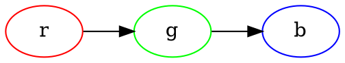

# 插图 {#figures}

通过`diagram-generator.lua`，可以直接在Markdown中内嵌流程图。如下面的代码可以生成一个有向图：

````

````


也可以使用Mscgen画图，代码和图如下：

````
```msc
msc {
    alice, bob;

    alice -> bob[label="Hello World!"];
    bob -> alice[label="你好，世界！"];
}
```
````

```msc
msc {
    alice, bob;

    alice -> bob[label="Hello World!"];
    bob -> alice[label="你好，世界！"];
}
```

可以给图片源加标题，如：

````
```{.graphviz caption="这是一张有标题的图片"}
digraph G {
    rankdir=LR
    a -> b -> c
}
```
````

```{.graphviz caption="这是一张有标题的图片"}
digraph G {
    rankdir=LR
    a -> b -> c
}
```

也可以这样引用图片，如图\ref{fig:example-1}所示。

````
```{.graphviz caption="\label{fig:example-1}这是另一张有标题的图片"}
graph G {
    rankdir=LR
    a -- b -- c
}
```
````

```{.graphviz caption="\label{fig:example-1}这是另一张有标题的图片"}
graph G {
    rankdir=LR
    a -- b -- c
}
```

我们使用自己搭的Gitea[^gitea]服务器管理我们的Markdown。为了能直接在Web界面上显示上述图片，我们写了一个浏览器插件：<https://git.xswitch.cn/xswitch/giteaBar> ，供大家参考。当然，团队中每个人都装插件比较麻烦，因此，我们弃用了上述插件，并[自己定制了一版](https://docs.gitea.io/en-us/customizing-gitea/)。

[^gitea]: 参见 <https://gitea.io/> 。

Github已经支持使用Mermaid[^mermaid]画图。直接使用如下语法即可。

[^mermaid]: 参见 <https://mermaid-js.github.io/mermaid/#/> 。

````

````

但我们的PDF中暂时还不支持这个语法，主要是Docker镜像已经很大了，如果再加上Mermaid，就会更大，而且，比起来，Mermaid来的图并不怎么好看。

后来，我还学会了使用Gnuplot[^gnuplot]画图。下面的图是我画的圆与正弦波的图。以后有了时间，我也会讲讲我是怎么画的。

[^gnuplot]: <http://www.gnuplot.info/> 。


