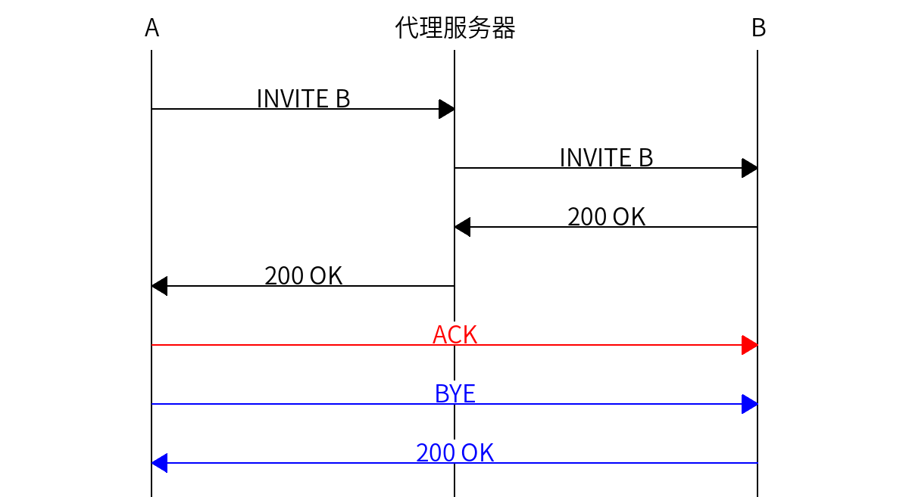
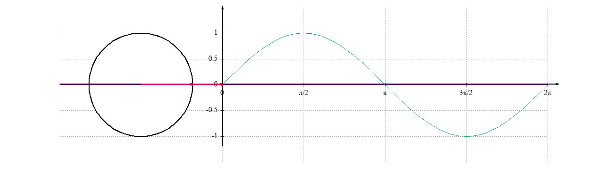
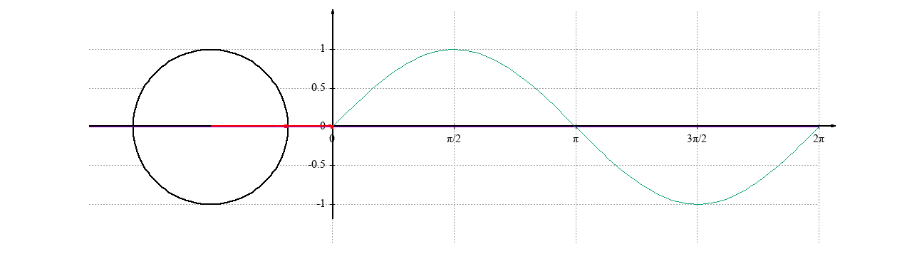
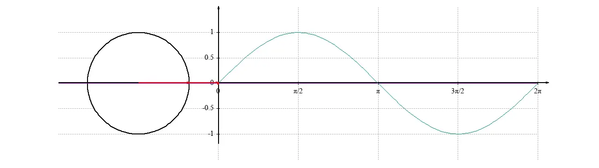
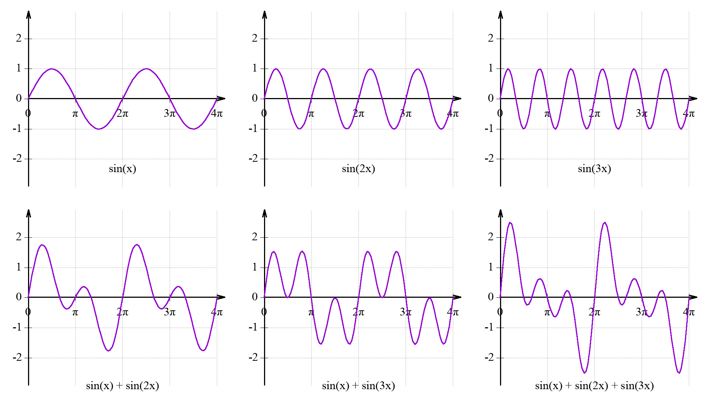

# 写作点滴 {#writing}

我写过两本书《FreeSWITCH 权威指南》和《Kamailio 实战》，也有一些新书在写作中。今天，就来跟大家分享一下我写作的一些经验、方法和工具等，希望对大家有所帮助。

首先是写作方法。写作的方法有千千万，每个人都有自己的写作方法，我使用的技巧其实并不多，主要是就是平时注意收集素材，然后当真正写的时候就有素材了，整理一下，就知道要写那些东西。

比如说我在平时的工作中，尤其是在处理一些问题的时候、在对客户进行支持的时候，经常会遇到各种各样的问题，这时我就会把一些案例记下来。如果有时间，就简单做一下整理，如果没有时间，那就先把原始记录、日志等记下来，等以后有时间再去整理。

这样到了真正写作的时候就可以先设计一下章节结构，把那些案例套进去。基本就是一篇文章或者一本书的草稿也就完成了。

总之就是要多积累素材，仓中有粮，心里不慌。

我最开始写《FreeSWITCH 权威指南》的时候，其实那时候还没有《权威指南》。当时主要是写写博客，然后就是把工作中遇到一些案例，整理成博客文章，发到网站上。这样后来就慢慢积累了很多的博客，当然在积累的过程中我也有意识地按一本书的样子添加相关的内容。然后大家看了说不错，就有人鼓动我写一本书。然后我就自己排了排版，印了一些，还卖了不少。

后来就对接了出版社。最早找了图灵，但图灵想先出电子版，而我比较想先出纸质版，后来华章同意出纸质版。然后跟出版社的编辑讨论了具体的章节目录，正式写作就开始了。不过真正写书跟写博客完全不一样。写博客比较简单、比较随意，但是写书的话就需要比较严谨，逻辑结构也得清晰、注意前后呼应。最开始想得很简单，觉得博客都写得差不多了，顶多是再补充一些章节，后来发现还差了一大半，又加上编辑排版，着实花了不少心力。虽然那时出版社的编辑没有天天催稿，但是心里的压力还是比较大的。但最终还是完成了，书出来后大家反响还不错。

当我写第二本书《Kamailio 实战》的时候就有些经验了，我等到基本上写完了之后又拿给编辑看的，他们还说杜老师你看你连排版都做好了，把我们的很多工作都做了（实际上他们还是要重新排版的）。

当然，不管你准备地多么完善，其实还是差很多，后面也还校对修改了很多次。总起来，这本书前前后后还是花了七个多月的时间。图书的出版流程本来比较慢，尤其是今年加上疫情等各种原因，我们基本上在各个环节都遇到了一些问题，结果导致书出来就比较慢，又过了五个多月大家才拿到书，这样总起来就是一年多。

下面主要是跟大家分享一下，我写作中使用工具之类的，希望对大家有所帮助。之前我也写过一篇文章《我在 Mac 上的写作工具链》，感兴趣的同学可以看一下，这里相当于再做一些补充。

我现在写作基本是使用 VSCode 和 Markdown。首先我本身是个程序员，VSCode 是常用的代码编辑器，Markdown 是一个简洁的文档格式，我平常积累素材也都是它们。提交到 Git 仓库里，内容也不会丢，还有版本控制。另外，做为技术书，我的书里有大量的代码，而 Markdown 对程序员非常友好。

但是出版社还是不会使用 Markdown，还是需要 Word 版的，所以说我一般都是写得的差不多了，先拿 PDF 给编辑看，然后在沟通差不多之后再转成 Word 格式。Word 中有一个“修订”功能非常有用，便于与编辑的沟通。在这一点上 Git 还是不方便。但 Word 文档要传来传去，有时我们也用 WPS，但我使用 macOS，编辑使用 Windows，总有些小的格式和字体问题无法很好地解决。好在格式不是重点，出版之前所有格式也都还会重排。现在出版社也开始在使用 WPS 之类的在线文档方便协同，减少传来传去的麻烦。

不过文档一旦转成 Word 格式，再转回 Markdown 就比较困难了，因此，我的 Markdown 还是停留在草稿状态，因为有一些最终的修改也不会再同步回来。

还有，这里有一个常识问题，就是我实际上是没有最终的电子版的。出版社最终的版本校对也是打印出来使用纸质版校对的。这可能主要是为了留下校对的“痕迹和证据”。另外，直接在纸上勾勾画画确实比在电子文档上做标记来得快。

当然，这里说到常识的主要原因是，很多人忽略了我没有电子版这个常识。我自己买自己的书的电子版也是需要花钱的，主要是电子书只能在一些数字出版平台如京东、以前的亚马逊、当当、微信读书之类的平台上，而不是直接发给我一个 PDF。国内的盗版还是比较严重，电子书就更容易被盗版。所以，如果大家看到这里，就不要跟我要电子书了，首先是我没有，其次是即使有也不能给到你。

回归主题，再说 Markdown，关于 Markdown，我还写了几篇文章，然后发到我们公司的网站上，大家感兴趣可以看一下[《小樱桃的 Markdown 规范》](https://docs.xswitch.cn/xpedia/markdown/)。Markdown 有很多版本，有时候为了排版和表达又做了一些扩充，我们也总结了一些比较好的使用经验，即保持简单，又能适当表达我们想要的格式。

下面再说下插图。不管什么样的文档一般或多或少都会有一些插图。画插图，我还是喜欢你[Graphviz](https://graphviz.org/)和[Mscgen](https://www.mcternan.me.uk/mscgen/)，我现在又学了一个新的技能[Gnuplot](http://www.gnuplot.info/)。

下图是 Graphviz 画的：

下面是 Mscgen 画的图：

做数字信号处理就不可避免地要讲付里叶变换，讲付里叶变换就得讲正弦曲线，所以我就用 Gnuplot 画了下面的图，包括动图：

JPG：

GIF：

WebP：

下面的视频是 webm 格式的，内容跟上面的动图一样，有的浏览器可能不能正常播放（在 PDF 版中也不可见）。

<video src="img/circle.webm" autoplay controls width="100%"/>

画合适图要使用合适的工具，每个工具都有它的长处。关于这些软件的使用方法和绘图的源文件示例，我后面有时间会整理出来。

我是个程序员，因此比较喜欢用代码生成图，这样更“精确”，且风格统一。而且使用这些代码还有一个好处就是我可以直接把代码嵌入到 Markdown 里，在生成 PDF、Word 文档或网页时可以自动生成图。这样所有的代码都 Commit 到 Git 仓库时里，以后再找原始文件修改的时候就很方便。而与之相对的，如果用了其它专业的作图工具生成图，由于图以及图的源文件一般都是二进制的，不适合存到 Git 仓库里，容易散落到各个地方导致以后找不到。

当然，为了能较好地排版，我还是花了不少心力的。一方面是我希望排成比较好看的电子书，另一方面就是我也希望我们产品文档能适合同时在网站上展示，同时能生成 PDF。作为一款 2B 的产品，我们不可避免地还是要分发 PDF 的手册。

Markdown 的好处其实主要是让你整理思路，把章节，重点、代码等用简单的标记标记出来，而无须过多关注排版。但无论如何还是要排版的，因为要给你看的话，别人看到的还是最终效果。我做了一些排版的模板，可以大致兼容比较多的场景，也能生成比较好的 PDF、docx 和 HTM 文档，感兴趣的同学可以看看[技术图书排版](https://github.com/seven1240/latex)。

另外，我还对 mscgen 打了补丁：<https://github.com/seven1240/mscgen>。主要是解决了图片分辨率的问题，在现代的视网膜显示器上，必须至少使用 2 倍的分辨率才能显示得比较清晰。而且印刷也需要大约 300dpi 的分辨率。原始的 Mscgen 是一个比较古老的工具，也不知道去哪里提交补丁，只好自己做了放到 Docker 镜像里。

除了这些工具外，还有一个比较新的流程图工具是[Mermaid](https://mermaid-js.github.io/mermaid/)。Mermaid 貌似功能更强大，而且好像 Github 的 Markdown 对它还有内建的支持。然而其工具链依赖于 Javascript 以及 Headless Chrome 等，装在 Docker 里非常耗资源，因而我也一直没有用。并且我也总觉得它画得图不如 Graphviz 和 Mscgen 画得好看。

最近在用墨问便签，体验了文字输入，感觉很方便。然后我就又学了一个新技能，在 macOS 上使用语音输入。开启的方法也很简单，在「设置」→ 「键盘」里就可以开启，开启后选择中文就可以了。然后每次启用语音输入就按两下 Fn 那个键，倒也方便。

之前我一直都是使用键盘输入的，我用五笔打字，一般速度也比较快，也没有动力使用语音输入，总感觉准确度不高又比较麻烦。另外就是因为我经常打字会有很多英文和代码，使用语音输入的话，中英文混合识别效果就比较差。但经过这次尝试，我觉得还是需要尝试一下新东西，而且，现在感觉或许是有点儿年纪大了，五笔输入法有个问题，就是早年记住字很容易打出来，不会打的字总打不出来，即使查了怎么打也不容易记住，很多时候还是要切换到拼音输入拼出来（这当然不能掩盖五笔输入法的好处，那就是不认识的字也能根据笔画打出来）。这就更有理由尝试使用语音输入了。反正语音输入也是先大致打个草稿，回头还需要再修正，遇到英语有时也只能先跳过去，回头再补。这篇文章就是断断续续用语音输入的，也许是刚开始不大熟练，感觉其实思路并没有那么快，语音讲出来的东西还是比较口语化，即使识别率正确，回头需要修改的内容也比较多。

最后还是回到我新出的这本书啊——《Kamailio 实战》。书刚印出来的时候出版社的仓库赶上封控，无法发货，因此我们把部分书从印刷厂直接运到了我们公司，一部分放到京东的仓库给大家发书，使用的是我们微信上的《小樱桃商城》。我们的商城比较简单，物流信息不能闭环。现在[出版社官方的天猫店](https://m.tb.cn/h.U86nD34)也上架了这本书，多了另一个购买选择，后面也陆续会有更多的商城上架，希望大家都能方便地买到书。

最最后，希望我的书以及本文能对大家有所帮助，也欢迎大家批评。

> 本文首先发表在[我的个人博客——杜金房的书](https://book.dujinfang.com/2022/12/18/writing.html)，转载请注明出处。
